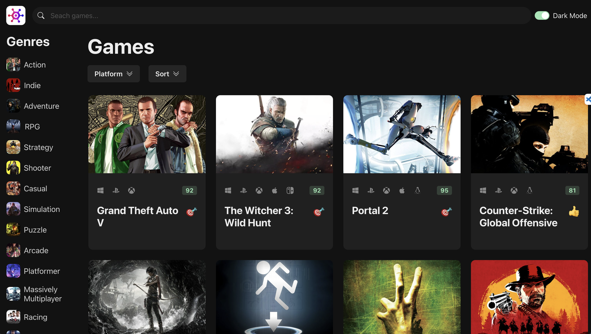

# 🎮 Game Hub

Game Hub is a video game discovery app built with **React 18** and **TypeScript**.  
It lets users browse games, filter by genre and platform, and explore new titles with a clean, responsive UI.

---

## 🌐 Live Demo

👉 **Game Hub on Vercel:** https://game-hub-eight-alpha-60.vercel.app

---
**Dashboard** — daily financial summary for the active business: wallet balances, quick transaction entry, and today's activity.


## ✨ Features

- 🎲 Browse a large collection of games fetched from an external API  
- 🧩 Filter games by **genre** and **platform**
- 🌗 **Dark mode** toggle  
- 📱 Fully **responsive layout** (desktop, tablet, mobile)
- ⚡ Fast, modern UI built with **Chakra UI**
- 🔁 Reusable custom hooks for fetching data

---

## 🧰 Tech Stack

- **Frontend:** React 18, TypeScript
- **UI Library:** Chakra UI
- **HTTP Client:** Axios
- **State & Data Management:** React hooks & custom hooks
- **Build Tooling:** Vite / Create React App (depending on setup)
- **Deployment:** Vercel

---

## 📚 About the Project

During the project, I learned and practiced:

- Modern React with hooks (useState, useEffect, custom hooks)
- TypeScript with React components and props
- Component composition and reusable UI patterns
- Working with REST APIs
- Managing loading and error states
- Responsive layouts with Chakra UI
- Deploying React apps to production (Vercel)

---

## 📂 Project Structure (high level)

```text
src/
  components/
    GameGrid.tsx
    GameCard.tsx
    GameCardSkeleton.tsx
    GameCardContainer.tsx
    NavBar.tsx
    ColorModeSwitch.tsx
    ...
  hooks/
    useGames.ts
    useGenres.ts
    useData.ts
  services/
    api-client.ts
  App.tsx
  main.tsx
```
## 🔮 Future Improvements

- Infinite scrolling  
- Favorites system  
- User authentication  
- Game trailers  
- Advanced filtering  
- Multi-language support  

## 👨‍💻 Author

Temirlan Asamidinov  
GitHub: https://github.com/TAsamidinov 
